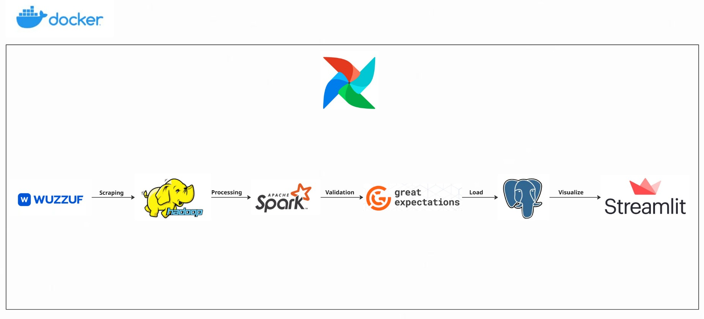

# 📊 WuzzufFlow: A Dockerized Data Pipeline for Job Analytics
WuzzufFlow is an end-to-end data engineering project that builds a complete, production-ready pipeline to collect, process, validate, and visualize job data from Wuzzuf.net. The project is fully containerized using Docker and orchestrated with Apache Airflow.



## 🚀 Overview

**WuzzufFlow** is a fully automated, Dockerized data pipeline designed to scrape job listings from [Wuzzuf](https://wuzzuf.net), process and validate the data, store it in a PostgreSQL database, and visualize it via an interactive Streamlit dashboard.

The project demonstrates real-world Data Engineering skills using modern open-source technologies such as:

- **Web Scraping** with `BeautifulSoup`
- **HDFS** for distributed storage
- **Apache Spark** for large-scale data transformation
- **Great Expectations** for data validation
- **PostgreSQL** for structured data storage
- **Streamlit** and `Plotly` for live dashboards
- **Apache Airflow** for orchestration and scheduling
- **Docker Compose** for environment management

---

## 🛠️ Tech Stack

| Task             | Tool/Technology             |
|------------------|-----------------------------|
| Web Scraping     | `BeautifulSoup`, `requests` |
| Storage Layer    | `HDFS`                      |
| Processing       | `Apache Spark`, `PySpark`   |
| Validation       | `Great Expectations`        |
| Database         | `PostgreSQL`                |
| Dashboard        | `Streamlit`, `Plotly`       |
| Orchestration    | `Apache Airflow`            |
| Containerization | `Docker Compose`            |

---

## 📂 Project Structure


```
.
├── airflow/
│   ├── dags/
│   │   ├── dag.py
│   │   └── Wuzzuf_data.csv
├── great_expectations/
│   └── validation_report.html
├── jars/
│   └── postgresql-42.7.7.jar
├── scraper/
│   └── scrape_wuzzuf.py
├── streamlit/
│   ├── app.py
│   └── requirements.txt
├── spark_jobs/
│   ├── __init__.py
│   ├── ge_validation.py
│   ├── load_to_postgres.py
│   ├── run_validation.sh
│   └── transform_wuzzuf.py
├── images/
│   └── Workflow.jpg
├── docker-compose.yml
└── Dockerfile
```


## 🧪 Validations
Applied Great Expectations tests on transformed data.

Generated HTML report stored at:

```
great_expectations/validation_report.html
```

---

## 📈 Dashboard Preview

Once the pipeline runs, you can access the Streamlit dashboard at:  
📍 `http://localhost:8501/`

The dashboard includes:

- Latest scraped job listings  
- Jobs per experience level (bar chart)  
- Jobs per work type (bar chart)
- Jobs per workplace (bar chart)  
- Jobs by country (top 10) 
- Jobs by city (top 10)  
- WordCloud of job skills  

---


## ⚙️ How It Works

1. **Scrape** job data from Wuzzuf using `scraper.py`.
2. **Store** raw data into HDFS.
3. **Transform** it using Apache Spark (e.g., normalize, clean skills).
4. **Validate** transformed data using Great Expectations.
5. **Load** clean data into PostgreSQL.
6. **Visualize** through an interactive dashboard using Streamlit.
7. **Orchestrate** the whole process using Apache Airflow.

---

Access the services:

Service	URL
Airflow	http://localhost:8080

Streamlit	http://localhost:8501

pgAdmin 	http://localhost:5050

HDFS Namenode	http://localhost:9870

Trigger the DAG manually or wait for its schedule.

## 📬 Contact

- 📧 **Email**: [mahmoud.reda.eltabakh@gmail.com](mailto:mahmoud.reda.eltabakh@gmail.com)
- 💼 **LinkedIn**: [https://www.linkedin.com/in/mahmoud-reda2001/](https://www.linkedin.com/in/mahmoud-reda2001/)


Feel free to connect or reach out for collaboration, job opportunities, or project feedback.


